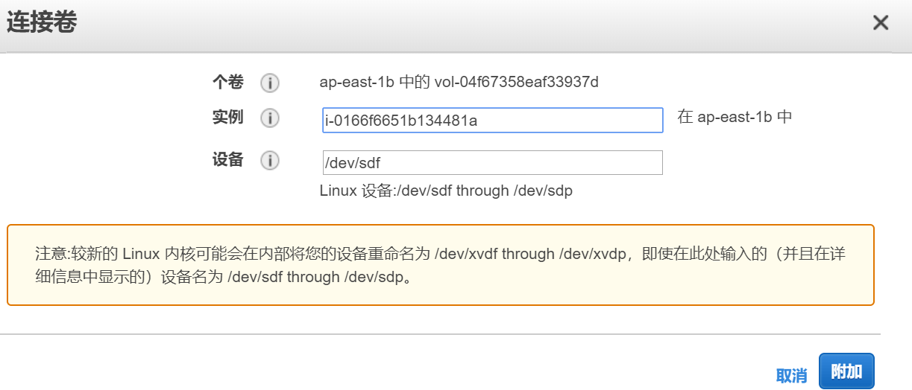

# 快速部署一台aws云主机

1. aws 官网启动机器

2. [Linux上面安装 Miniconda](https://docs.conda.io/projects/conda/en/latest/user-guide/install/linux.html)

   ```bash
   bash Miniconda3-latest-Linux-x86_64.sh
   ```

   添加路径

   ```
   export PATH="/home/ubuntu/miniconda3/bin/conda:$PATH"
   
   source ~/.bashrc
   ```

3. 腾讯云上面配置网页映射

4. aws增加新的ssd
   1. 添加卷
   2. 

3. 使用命令行安装 - 这步应该没事了

   ```
   sudo apt install awscli
   ```

   

   ```
   aws ec2 attach-volume --volume-id vol-04f67358eaf33937d --instance-id i-0166f6651b134481a --device /dev/sdf --region ap-east-1b
   ```

   

```bash

sudo file -s /dev/nvme1n1


(base) ubuntu@ip-172-31-6-96:~/workspace$ sudo mkfs -t xfs /dev/nvme1n1
meta-data=/dev/nvme1n1           isize=512    agcount=4, agsize=655360 blks
         =                       sectsz=512   attr=2, projid32bit=1
         =                       crc=1        finobt=1, sparse=0, rmapbt=0, reflink=0
data     =                       bsize=4096   blocks=2621440, imaxpct=25
         =                       sunit=0      swidth=0 blks
naming   =version 2              bsize=4096   ascii-ci=0 ftype=1
log      =internal log           bsize=4096   blocks=2560, version=2
         =                       sectsz=512   sunit=0 blks, lazy-count=1
realtime =none                   extsz=4096   blocks=0, rtextents=0

sudo mkdir data

```

**sudo growpart /dev/nvme0n1 1**

https://docs.aws.amazon.com/zh_cn/AWSEC2/latest/UserGuide/recognize-expanded-volume-linux.html


需要重启一下

# python flask html互相传递参数